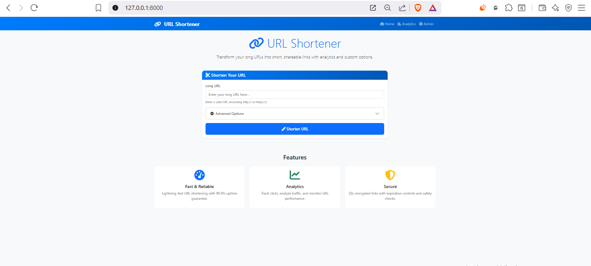

# Django URL Shortener

[](https://www.djangoproject.com/)
[](https://opensource.org/licenses/MIT)

A fully-featured URL shortening service built with Django that provides custom short URLs, analytics, and expiration features.



## Features

### ✅ Required Features

* **Custom Short URL Generation**
  * Generate unique short codes (e.g., `abc123`)
  * Store mappings in the database

* **Redirection Handling**
  * Instant redirect to original URLs

* **Frontend Interface**
  * Responsive Bootstrap UI
  * URL submission form
  * Display generated short URL

* **Admin Panel**
  * View all URL mappings
  * Track creation dates and click counts

### ✨ Optional Features
* Copy-to-Clipboard for short URLs
* URL Expiration (configurable timeframe)
* Click Analytics tracking
* Bootstrap 5 responsive design
* Active/Inactive URL management

## Technology Stack
* **Backend:** Django 4.2.7
* **Frontend:** Bootstrap 5, JavaScript
* **Database:** SQLite (default)
* **Deployment:** WSGI-compatible

## Setup Instructions

### Prerequisites
* Python 3.9+
* `pip` package manager

### Installation
1. **Clone the repository**

   ```bash
   git clone https://github.com/Aziz2597/Django-URL-Shortener.git
   cd Django-URL-Shortener
   ```

2. **Create and activate virtual environment**
   ```bash
   # Windows
   python -m venv venv
   venv\Scripts\activate

   # macOS/Linux
   python3 -m venv venv
   source venv/bin/activate
   ```

3. **Install dependencies**
   ```bash
   pip install -r requirements.txt
   ```

4. **Apply database migrations**
   ```bash
   python manage.py migrate
   ```

5. **Create admin user (if not created)**
   ```bash
   python manage.py createsuperuser
   ```

6. **Run development server**
   ```bash
   python manage.py runserver
   ```

### Access the Application
* Main interface: `http://localhost:8000`
* Admin panel: `http://localhost:8000/admin`

## Project Structure

```plaintext
Django-URL-Shortener/
├── urlshort/                 # Main application
│   ├── migrations/           # Database migrations
│   ├── templates/            # HTML templates
│   ├── static/               # CSS/JS assets
│   ├── admin.py              # Admin configuration
│   ├── apps.py               # App config
│   ├── models.py             # Database models
│   ├── tests.py              # Unit tests
│   ├── urls.py               # App routes
│   └── views.py              # Business logic
├── shortener/                # Project configuration
│   ├── settings.py           # Django settings
│   ├── urls.py               # Project routes
│   └── wsgi.py               # Production deployment
├── .gitignore                # Git ignore file
├── manage.py                 # Django CLI
├── README.md                 # Project documentation
└── requirements.txt          # Dependencies
```

## Usage Guide
### Creating Short URLs

1. Visit `http://localhost:8000`.
2. Enter the long URL in the input field.
3. Click **Shorten URL**.
4. Copy the generated short URL using the copy button.

### Accessing Short URLs
* Navigate to `http://localhost:8000/{short_code}` to be redirected.
* Click counts increment automatically.

### Admin Features
* Visit `http://localhost:8000/admin`.
* View all URL mappings with creation dates and click counts.
* Monitor expiration status and deactivate URLs manually.

## Troubleshooting
* **Database errors:** Run:
  ```bash
  python manage.py migrate --run-syncdb
  ```

* **Missing dependencies:** Reinstall:
  ```bash
  pip install -r requirements.txt
  ```

* **Port conflicts:** Use a different port:
  ```bash
  python manage.py runserver 8080
  ```

---

© 2025 Aziz2597. Licensed under [MIT](https://opensource.org/licenses/MIT).
